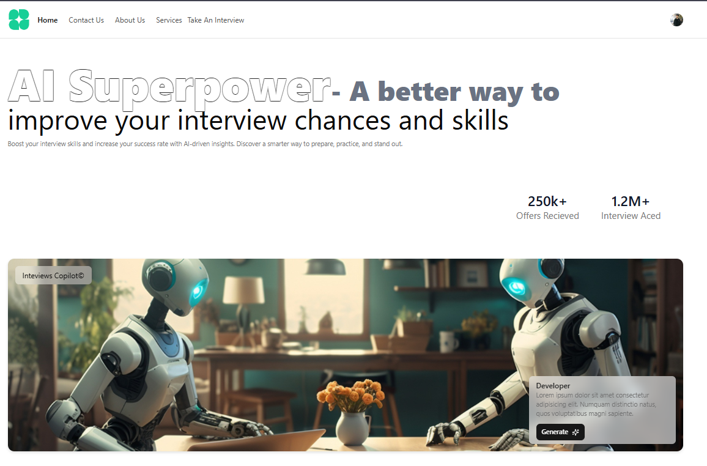
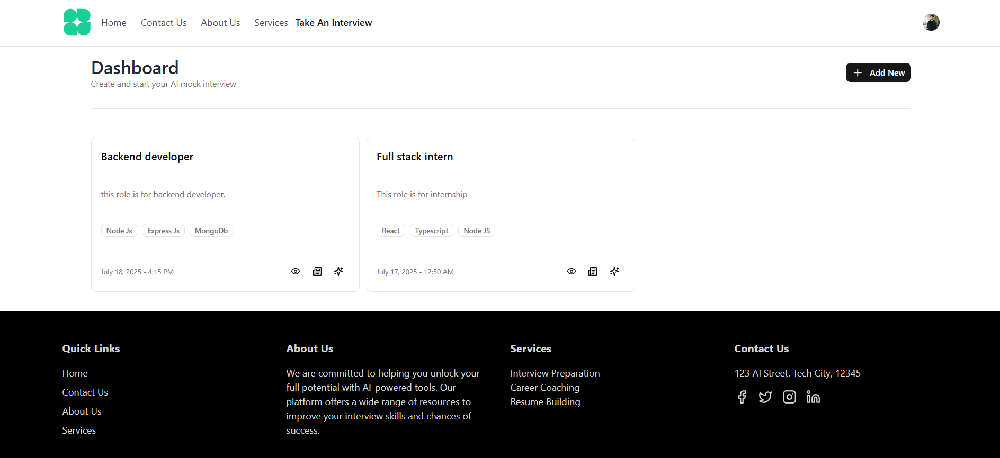
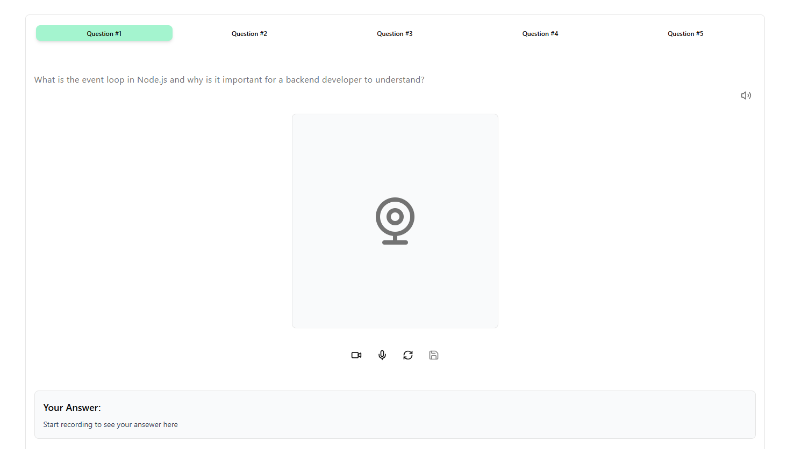
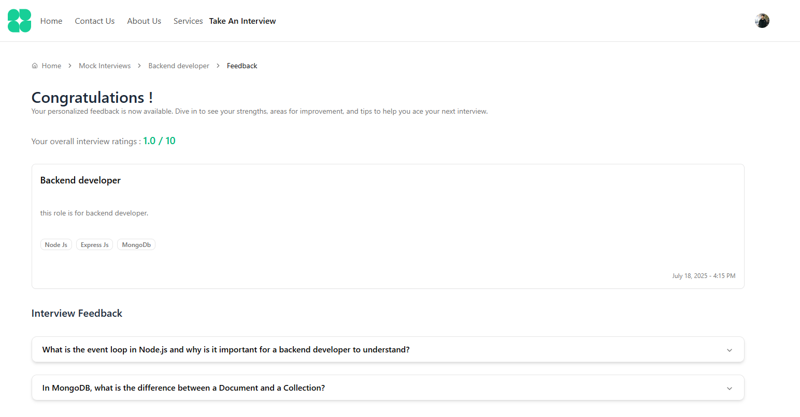
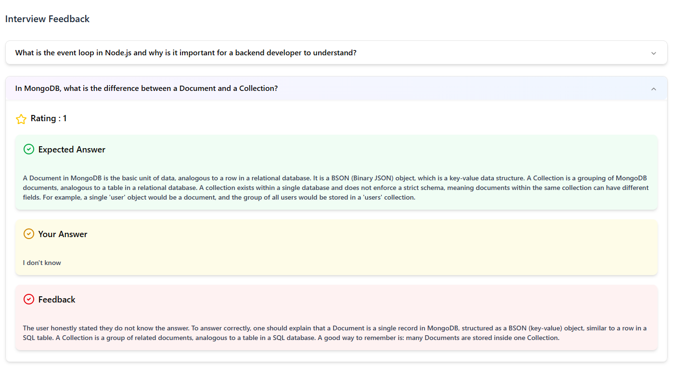

# 🧠 React AI Mock Interview Platform

An innovative web application that simulates real-world mock interviews using cutting-edge AI. Designed to empower job seekers, students, and professionals with personalized practice, instant feedback, and an intuitive experience — all in one place.

[🌐 Live Demo on Render](https://ai-mock-interview-platform-u5tu.onrender.com)


---

## 🚀 Features

### 🤖 AI-Powered Mock Interviews
Simulate realistic interview scenarios powered by **Google Gemini AI**. Receive intelligent feedback on your responses and improve your performance over time.

### 🔐 Seamless Authentication
Secure login and sign-up with **Clerk**, offering social login options and user session management.

### 🎯 Dynamic Interview Customization
Tailor your mock interviews based on:
- Job roles (Developer, Analyst, Designer, etc.)
- Technical or behavioral domains

### 📊 Real-Time AI Insights
Get instant, AI-driven feedback on:
- Verbal responses
- Technical answers
- Soft skills and communication

### 📁 Data Management with Firebase
All user data, interview analytics, and settings are securely stored and managed via **Google Firebase Firestore**.

### 🧩 Interactive Questionnaires
Experience a wide range of question types:
- Multiple-choice
- Scenario-based
- Code snippets
- Voice-based input 

### 📈 User Dashboard
View past interviews, progress reports and strengths/weakness analysis.

---

## 🧪 Tech Stack

| Layer           | Technology                    |
|----------------|-------------------------------|
| Frontend        | React.js                      |
| Authentication  | Clerk                         |
| UI Framework    | Shadcn UI                     |
| Database        | Firebase Firestore            |
| AI Integration  | Google Gemini AI              |

---

## 🛠️ Setup & Installation

### 1. Clone the repository
```bash
git clone https://github.com/your-username/mock-interview-platform.git
cd mock-interview-platform
```

### 2. Install dependencies
```bash
npm i -g pnpm
pnpm install
```

### 3. Start the development server
```bash
pnpm run dev
```

### 4. Firebase Initialization
```bash
firebase init
```
### 5. Firebase Deploy
```bash
firebase deploy
```
### 6. Project Build
```bash
pnpm run build
```
## Environment Variable
### Ensure the following environment variables are set up in a .env file:
```bash
VITE_FIREBASE_API_KEY=YOUR_API_KEY_REF
VITE_FIREBASE_AUTH_DOMAIN=YOUR_API_KEY_REF
VITE_FIREBASE_PROJECT_ID=YOUR_API_KEY_REF
VITE_FIREBASE_STORAGE_BUCKET=YOUR_API_KEY_REF
VITE_FIREBASE_MESSAGING_SENDER_ID=YOUR_API_KEY_REF
VITE_FIREBASE_APP_ID=YOUR_API_KEY_REF
```
## 📸 Screenshots

### 🏠 Index Page


### 📊 Dashboard


### 🎙️ Interview Interface


### 📈 Result Page


### 🤖 AI Feedback


# 🧑‍💻 Author
## Rishabh Agrawal
### Feel free to reach out for collaboration, feedback, or contributions!

## 📄 License
### This project is licensed under the MIT License.


